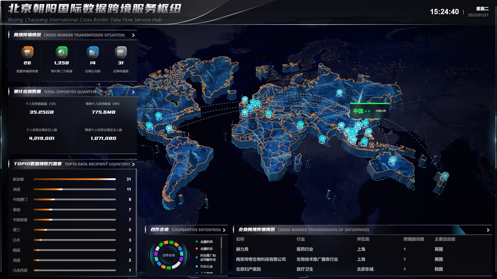

## 预览

## 项目依赖

1. [Vue 官方文档](https://cn.vuejs.org/)
2. [Echarts 官方文档](https://echarts.apache.org/zh/index.html)
3. [Threejs 官方文档](https://threejs.org/)
4. [gsap 官方文档](https://gsap.com/)

## 主要文件介绍

| 文件              | 作用/功能                                                    |
| ----------------- | ------------------------------------------------------------ |
| components        | 公共组件，shader，echart组件                                  |
| hooks   | 城市模型相关                                                   |
| mini3d    | 3D地图相关                           |

###  

## 使用介绍

### 安装

```npm
npm/pnpm/yarn install
```
### 启动

```npm
npm run dev
```
### 构建

```npm
npm run build
```
